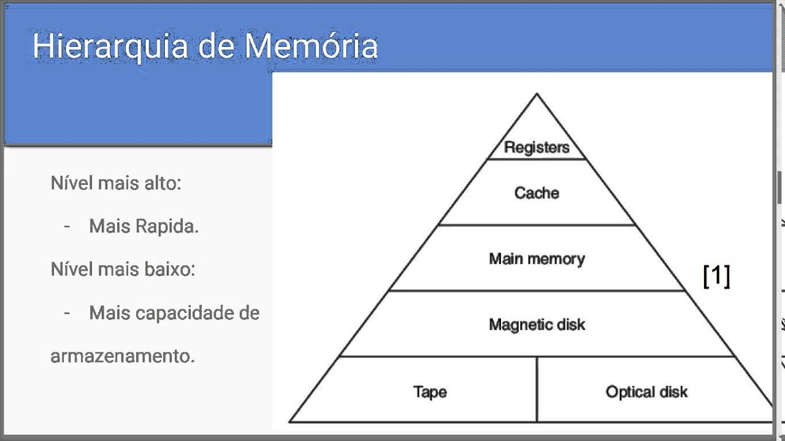

# Aula 18 - Hierarquia de memória
(02/02/23)
-------------
- É preciso de memória para o processamento
- Cache > ram > hd (velocidade)
- placa de vídeo - memoria independente - muitos nucleos bom para processamentos paralelizados (jogos, IA...)
- Fazer a leitura do livro sobre
- Memória RAM é volátil -  tem uma frequencia em q ela é realimentada

## Organização hierarquica (mais proximo do processador)
1. Registradores (IMEDIATO)
2. Memória cache | -> Memória principal
3. Memória RAM   |
4. Disco (persistente) -> memória secundária
     
     ↕ Os dados trafegam apenas entre níveis adjacentes

### Processador requisita dados da cache
- Dado presente: **Acerto**
- Dado ausente: **Falha**

### Objetivo do sistema de memória
- Máximizar a taxa de acertos

### Principio de localidade
- Temporal: Um dado acessado tende a ser acessado novamente em breve (laços)
- Espacial: Se um dado foi acessado, dados proximos tendem a ser acesasdos em breve 

obs: memória ram e memória cache tem o msm endereço

## Memória Principal
(foto)